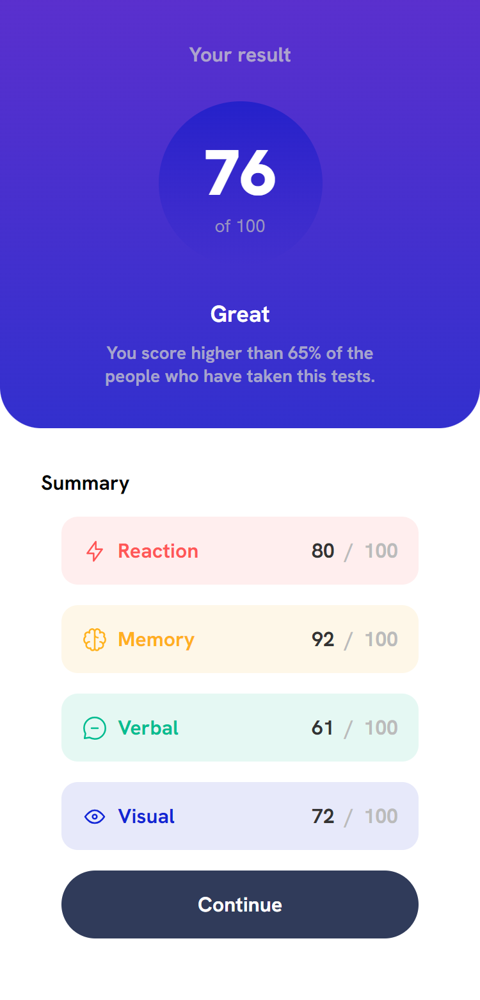

# Frontend Mentor - Results summary component solution

This is a solution to the [Results summary component challenge on Frontend Mentor](https://www.frontendmentor.io/challenges/results-summary-component-CE_K6s0maV). Frontend Mentor challenges help you improve your coding skills by building realistic projects. 

## Table of contents

- [Overview](#overview)
  - [The challenge](#the-challenge)
  - [Screenshot](#screenshot)
  - [Links](#links)
  - [Built with](#built-with)
- [Author](#author)

## Overview

### The challenge

Users should be able to:

- View the optimal layout for the interface depending on their device's screen size
- See hover and focus states for all interactive elements on the page

### Screenshot

### Links

- Solution URL: [Solution in Frontend Mentor page](https://your-solution-url.com)
- Live Site URL: [Results Summary Component](https://frontend-mentor-summary.vercel.app/)

### Built with

- Semantic HTML5 markup
- CSS custom properties
- Flexbox
- Mobile-first workflow
- Atomic Design
- [Vite](https://vitejs.dev/) - Frontend tooling
- [React](https://reactjs.org/) - JS library
- [Styled Components](https://styled-components.com/) - For styles
- [Framer Motion](https://www.framer.com/motion/) - For animations
- [Vercel](https://vercel.com/) - For deploy

## Author

- Frontend Mentor - [@yourusername](https://www.frontendmentor.io/profile/tomascarrizodev)
- LinkedIn - [Tomas Carrizo](https://www.linkedin.com/in/tomascarrizodev/)